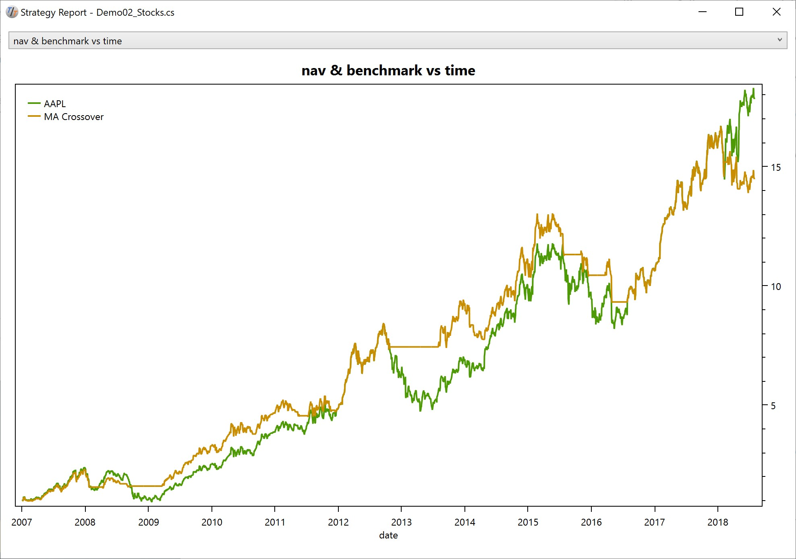

# Demo 02: Trading Single Instruments

This demo loads a range of quote data for common stock, calculates indicators, and places trades based on the indicator values. We demonstrate the following key concepts:

* setting initial capital
* determining net asset value
* placing orders
* keeping track of positions

The method implemented here is a simple moving-average crossover, as this is easy to understand and widely referenced. Please don't use this for actual trading. 

## Setting Initial Capital

Before we start trading, we first need to set the simulator's initial capital. To do so, we need to make a [Deposit](xref:TuringTrader.Simulator.SimulatorCore#TuringTrader_Simulator_SimulatorCore_Deposit_System_Double_), just like in the real world.

```c#
Deposit(100000);
```

Similarly, we can also make a withdrawal using the [Withdraw](xref:TuringTrader.Simulator.SimulatorCore#TuringTrader_Simulator_SimulatorCore_Withdraw_System_Double_) method. We can use the 
[Cash](xref:TuringTrader.Simulator.SimulatorCore#TuringTrader_Simulator_SimulatorCore_Cash) property at any point during the simulation, to determine the amount of cash at hand.

These deposits and withdrawals allow us to simulate savings plans, or retirement scenarios, or model the withdrawal of monthly fees.

## Determining Net Asset value

During a simulation, we typically hold a combination of cash and assets, and we are interested in the net asset value of our portfolio, which is the sum of cash at hand, and the liquidation value of all positions we hold. The simulator calculates the net asset value on every bar and provides it through the [NetAssetValue](xref:TuringTrader.Simulator.SimulatorCore#TuringTrader_Simulator_SimulatorCore_NetAssetValue) time series.

To place a trade, we need to calculate the number of shares we can afford. Here is an example, showing how to do that:

```c#
int targetPosition = (int)Math.Floor(NetAssetValue[0]
                                     / instrument.Close[0]);
```

Please note that this calculation might not be exact, in case of significant changes in the instrument's price before we can place and fill the order.

As the net asset value is a time series, we have easy access to the recent performance of our trading system. For example, we could determine the highest high of the last month like this: 

```c#
double highestHigh = NetAssetValue.Highest(21)[0];
```

This feature comes handy for implementing money-management schemes. As an example, a strategy might scale back exposure after a losing streak.

## Placing Orders

To place an order, we use the [Trade](xref:TuringTrader.Simulator.Instrument#TuringTrader_Simulator_Instrument_Trade_System_Int32_TuringTrader_Simulator_OrderType_System_Double_System_Func_TuringTrader_Simulator_Instrument_System_Boolean__) method. In its simplest form, it takes only one parameter: the number of shares/ contracts to trade. A positive value is equivalent to buying the instrument, while a negative value denotes selling the instrument. The following snippet places a market order, executed at the next bar's open:

```c#
instrument.Trade(100);
```

There are various overloads to this method, for placing stop and limit orders. We discuss these in [another demo](Demo06.md).

## Keeping Track of Positions

To place orders more intelligently, we need information on the positions we currently hold. We use an instrument's [Position](xref:TuringTrader.Simulator.Instrument#TuringTrader_Simulator_Instrument_Position) property to determine the position in this specific instrument. The integer returned for the position size is positive for long positions, negative for short positions, and zero if we are flat:

```c#
int currentPosition = instrument.Position;
```

 Also, the simulator tracks all open positions via its [Positions](xref:TuringTrader.Simulator.SimulatorCore#TuringTrader_Simulator_SimulatorCore_Positions) property. Flat instruments are removed from this dictionary. Using this property, we can check if we are holding any positions at all: 

```c#
bool allFlat = Positions.Count == 0;
```

This property is handy when handling portfolios, and we revisit it in a [future demo](Demo03.md). 

With the current position at hand, we can code an improved way of placing orders. To do so, we place an order for the difference between a target position and our current holding. Note that orders with a zero quantity are ignored, so there is no need to check for that: 

```
instrument.Trade(targetPosition - currentPosition,
                 OrderType.openNextBar);
```

If you haven't done so, check the [indicator demo](Demo01.md). Here is how we put this all together to trade moving averages:

```c#
// calculate moving averages
ITimeSeries<double> slow = instrument.Close.EMA(63);
ITimeSeries<double> fast = instrument.Close.EMA(21);

// determine current and target position size
int currentPosition = instrument.Position;
int targetPosition = fast[0] > slow[0]
	? (int)Math.Floor(NetAssetValue[0] 
	                  / instrument.Close[0]) // bullish => long
	: 0;                                     // bearish => flat

// place orders
instrument.Trade(targetPosition - currentPosition, 
                 OrderType.openNextBar);
```

Please find the full code for this demo in our [repository](https://bitbucket.org/fbertram/fub_tradingsimulator/src/develop/Algorithms/Demo%20Algorithms/Demo02_Stocks.cs).

Once the demo completes, we can see how the algorithm attempts to follow bullish trends and exit positions in bearish times: 

