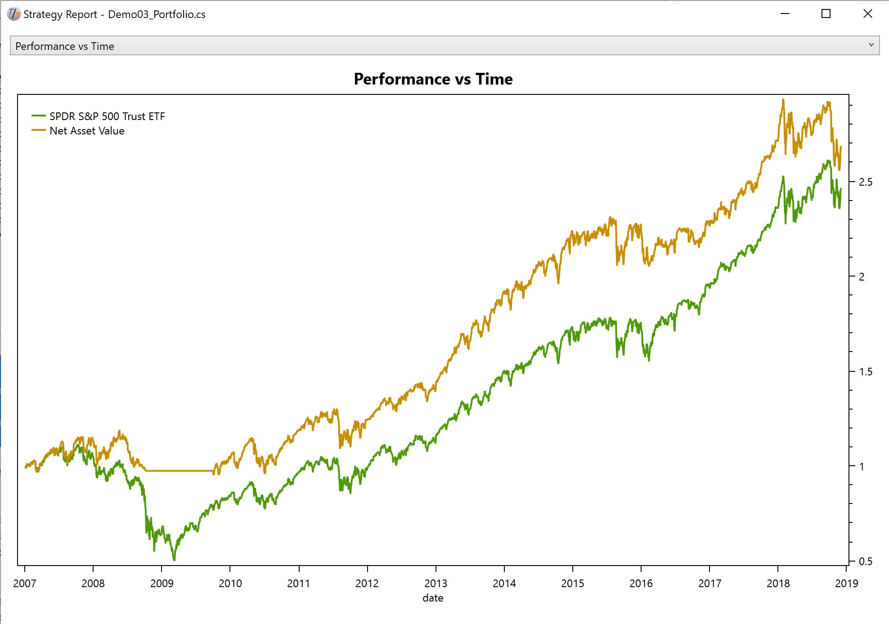
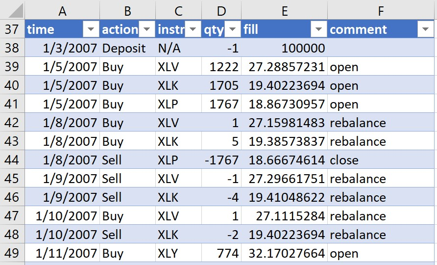

# Demo 03: Trading Portfolios

In this demo, we load data for several sector ETFs, calculate indicators, create a portfolio based on the indicator values, and re-balance this portfolio. We demonstrate the following key concepts: 

* initialization for multiple instruments
* determining active instruments
* calculating indicators for multiple instruments
* portfolio selection
* placing orders
* creating a trading log

The strategy bases its decisions on ranking the instrument's Return over Maximum Drawdown. Please don't use this for actual trading. 

## Initialization for Multiple Instruments

The first lines of our strategy initialization are identical to what we have done for trading a [single instrument](Demo02.md): 

```c#
StartTime = DateTime.Parse("01/01/2007");
EndTime = DateTime.Parse("12/01/2018");
Deposit(100000);
```

To access instruments during simulation, we need their nicknames. When trading multiple instruments, this quickly gets confusing. To make things easier, it is a good idea to set up some helper fields:

```c#
private readonly string _spx = "$SPX";
private readonly List<string> _universe = new List<string>()
{
    "XLY", "XLV", "XLK",
    "XLP", "XLE", "XLI",
    "XLF", "XLU", "XLB",
};
```

Using these fields, we can conveniently add our data sources:

```c#
AddDataSource(_spx);
foreach (string nickname in _universe)
    AddDataSource(nickname);
```

## Determining the Active Instruments

When trading portfolios, we need to keep track of the instruments available at any given bar. Our universe might change over time, with companies having their IPO after the simulation started, and merging or delisting their stock before the simulation ends.

TuringTrader adds instruments to its [Instruments](xref:TuringTrader.Simulator.SimulatorCore#TuringTrader_Simulator_SimulatorCore_Instruments) collection when they start receiving bars and removes them after they become stale. This code snippet provides an enumerable of active instruments:

```c#
var activeInstruments = Instruments
        .Where(i => i.Time[0] == simTime
                    && _universe.Contains(i.Nickname));
```

## Calculating Indicators for Multiple instruments

Typical portfolio strategies perform a ranking of instruments, based on indicator values. TuringTrader can conveniently calculate indicators for many instruments with just a single LINQ expression. To make sure we call our indicators exactly once per bar and for each instrument, it is best practice to calculate them at the top of the simulation loop and store the results in a collection:

```c#
var evalInstruments = activeInstruments
    .Select(i => new
    {
        instrument = i,
        romad = i.Close.ReturnOnMaxDrawdown(252)[0],
    })
    .ToList();

```

## Portfolio Selection

With the indicators calculated, we are now ready to select our portfolio. Again, the code is very concise thanks to using LINQ. In this example, we are looking for the RoMaD to be positive, and are limiting our portfolio to a subset of instruments with the highest RoMaD: 

```c#
var holdInstruments = evalInstruments
    .Where(e => e.romad > 0.0)
    .OrderByDescending(e => e.romad)
    .Take(7)
    .Select(e => e.instrument)
    .ToList();
```

## Trading the Portfolio

Now that we have our portfolio instruments selected, we are ready to trade them. We start by determining the target equity per instrument. Next, we loop through all instruments, determine the current position and target position, and trade the difference: 

```c#
double equityPerInstrument = NetAssetValue[0]
                / Math.Max(holdInstruments.Count, 3);
foreach (Instrument instr in activeInstruments)
{
    double targetEquity = holdInstruments.Contains(instr)
        ? equityPerInstrument
        : 0.0;

    int targetShares = (int)Math.Floor(targetEquity 
                                       / instr.Close[0]);
    int currentShares = instr.Position;

    Order newOrder = instr.Trade(targetShares - currentShares);
}

```

For analysis of trading logs, it might be helpful to attach a comment to the order ticket. Here is a simple example:

```c#
if (newOrder != null)
{
    if (currentShares == 0)
        newOrder.Comment = "open";
    else if (targetShares == 0)
        newOrder.Comment = "close";
    else
        newOrder.Comment = "rebalance";
}
```

Our algorithm is now ready to run. Here is how the equity curve looks like, compared to a benchmark: 



## Creating a Trading Log

For a detailed analysis of an algorithm, we need a trading log. TuringTrader keeps information on all transactions in the [Log](xref:TuringTrader.Simulator.SimulatorCore#TuringTrader_Simulator_SimulatorCore_Log) property, which we can collect after finishing the event loop:

```c#
_plotter.SelectChart("trades", "time");
foreach (LogEntry entry in Log)
{
    _plotter.SetX(entry.BarOfExecution.Time);
    _plotter.Plot("action", entry.Action);
    _plotter.Plot("instr", entry.Symbol);
    _plotter.Plot("qty", entry.OrderTicket.Quantity);
    _plotter.Plot("fill", entry.FillPrice);
    _plotter.Plot("comment", entry.OrderTicket.Comment ?? "");
}
```

Excel works best for analyzing trade logs, thanks to its filtering features. Here is a snippet of the trading log rendered with Excel:



As always, find the full code for this demo in our [repository](https://github.com/fbertram/TuringTrader/blob/master/Algorithms/Demo%20Algorithms/Demo03_Portfolio.cs).