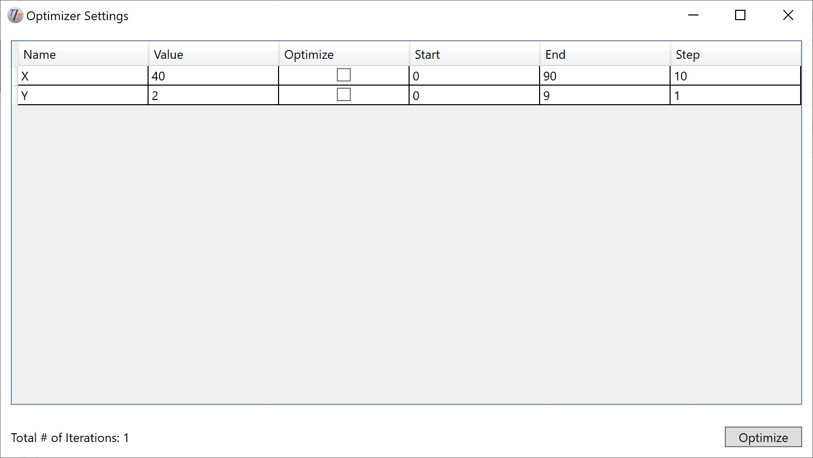
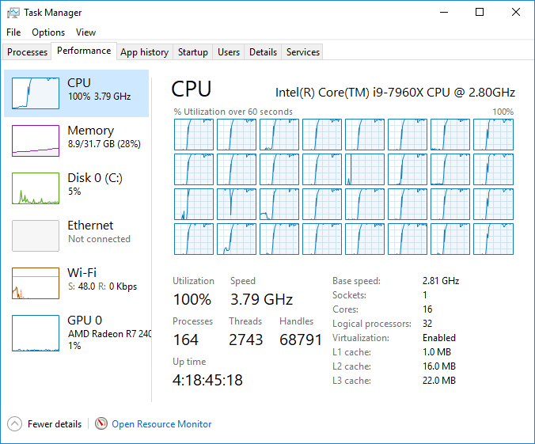

# Demo 05: Running the Optimizer

When developing algorithmic trading strategies, we often face situations in which we need to quantify a relationship between an outcome and an indicator. Creating this quantified relationship is greatly simplified with an optimizer.

This demo shows how to use TuringTrader's built-in optimizer. While it does not do anything useful, it presents the following concepts:
* declaring optimizable parameters
* running the optimizer
* custom fitness values

## Declaring Optimizable Parameters

For TuringTrader to recognize a parameter as optimizable, the parameter must meet the following requirements:

* integer-based
* public, not static
* preceded by the [OptimizerParam attribute](xref:TuringTrader.Simulator.OptimizerParamAttribute)
* either a field or a property

Here is an example declaring two parameters:     

    [OptimizerParam(0, 90, 10)]
    public int X { get; set; }
    
    [OptimizerParam(0, 9, 1)]
    public int Y;

The [OptimizerParam attribute](xref:TuringTrader.Simulator.OptimizerParamAttribute) takes the following optional arguments:
* start value
* end value
* step

These arguments are used to initialize the optimizer settings later.

## Running the Optimizer

If an algorithm exposes any optimizable parameters, the `Optimize` button is enabled, as soon as the algorithm is loaded. Clicking the `Optimize` button opens the optimizer settings dialog.



The start, end, and step values are initialized from the [OptimizerParam attributes](xref:TuringTrader.Simulator.OptimizerParamAttribute). At this point, you can take the following actions to set up the optimization:

* setting a parameter to a fixed value, by entering a new value in the Value column
*  enabling a parameter for optimization, by checking the box in the Optimize column
* modifying the start, end, and step values in the respective columns

Once you finished setting up the parameters, you are ready to start the optimizer by clicking the `Optimize` button.

TuringTrader's optimizer is multi-threaded and uses all available CPU cores. It, therefore, runs best on a machine with many CPU cores. Here is a screenshot from optimization on a 16-core i9:



## Optimization Results

Once the optimization has finished, TuringTrader opens the results dialog with one row per optimizer iteration. Each row contains the following values:

* Net Asset Value at the end of the simulation
* Maximum Drawdown in percent over the full length of the simulation
* Fitness value

The rows can be sorted by clicking on the column headers.


To apply the parameters from a specific optimizer iteration, and run a backtest with these parameters, double-click the row.

## Custom Fitness Value

While it is easy to optimize for maximum return, or minimum drawdown we'd like to discourage developers from doing so. Instead, we recommend defining a fitness value, capturing your specific optimization objectives, and optimize for that. A strategy can assign a custom fitness value through the [FitnessValue](xref:TuringTrader.Simulator.Algorithm#TuringTrader_Simulator_Algorithm_FitnessValue) property.

For the demo, we chose to use a non-sensical value:

```c#
FitnessValue = X + Y;
```

For real-life strategies, we recommend a measure of risk-adjusted return. Here is an example calculating the return over maximum drawdown:

```c#
FitnessValue = (NetAssetValue[0] / INITIAL_CASH - 1.0) 
    / TradingDays * 252.0 
    /  NetAssetValueMaxDrawdown;
```

Before you start brute-force optimization of multiple parameters, consider optimizing smaller subsets of parameters sequentially. Doing so reduces the search space significantly, leading to faster results.

Also, to avoid wasting many hours of CPU time, we recommend playing around with the demo until you fully understand how the optimizer is working. The full source code of the demo is available [here](https://bitbucket.org/fbertram/fub_tradingsimulator/src/develop/Algorithms/Demo%20Algorithms/Demo05_Optimizer.cs).